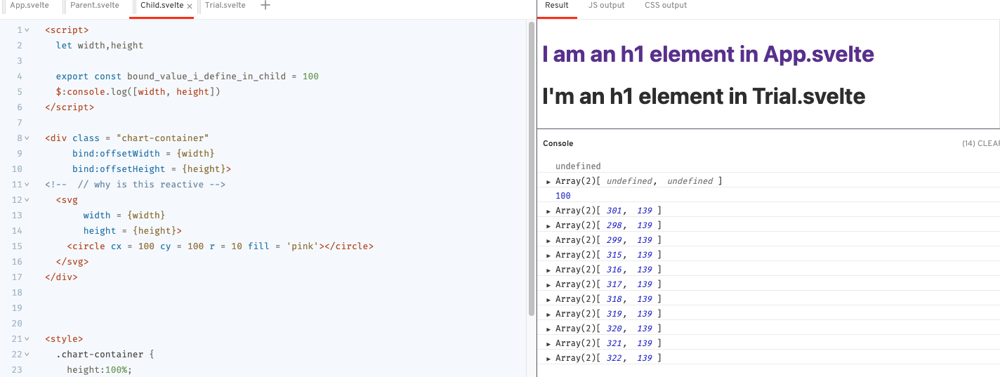

# How large is my plot going to be?

>The series is not going to be a comprehensive introduction to D3.js or Svelte.js, but will share my personal experience of creating data visualizations using Svelte+d3.
>The API documentation is [intimidatingly huge](https://github.com/d3/d3/blob/master/API.md), but there is a subset of it that lays a crucial foundation for reading and writing programs that use d3. My intention here is to communicate those foundations in a way that I would have liked to have had them communicated to me when I was starting out, and have you using it confidently rather than hesitantly.
>
>My intention here is to expose my learning experience as a reference so as to lay a foundation for **you** to build a mental model for creating data visualization work in Svelte, or, to the best, to facilitate your work in a Svelte data visualization environment. (I was so eager to see such examples when I was starting out) 
>
>Feel free to shoot me questions or correct me if you find me wrong since I am still a learner and always making mistakes.

In my first study notes, we learned how to import data, but it is not even to be able to log your data.

With data in our hands, where are we going to plot them? How large should this "where" be before we create it? Should it be the same size of my phone or my laptop?

**Today I will show you where to plot data in Svelte **

## 							Bind: Extract value from component/element

You should be able to find detailed explanation of **bind** on Svelte's website. My understanding of `bind` right now is that **it can extract specified value/property from the bound component or element and assign the value to variables in {}**

*Go to the [example](https://svelte.dev/repl/a63b1d9ae45f487eb77fb2ce00946efc?version=3.38.2) for detailed code.*

### Bind value of a component

Let's do a simple one. 

```html
<Child
	 bind:bound_value_i_define_in_child = {bound_value_i_define_in_parent}/>
```

This is basically saying the value of the variable, `bound_value_i_define_in_child`, from child component now it's assigned to the variable, `bound_value_i_define_in_parent`, in the parent component.

If you console.log `bound_value_i_define_in_parent` in parent component, you should be able to see the value 100 in the console

```javascript
$: console.log(bound_value_i_define_in_parent) // returns 100
```

### Bind value of an element

There is one <h1>element in the DOM. It looks large, or at least, wide. Can we know the exact width of it? 

Here comes the magical offsetWidth property:

```javascript
console.log(document.querySelector('h1').offsetWidth)
```

We are basically saying: hey <h1>, tell me your width now. If you are checking the console on your laptop, you will see the current width of <h1>. A smaller number will show up if you are looking at the console on your phone/iPad. **It's all based on your device size**. Isn't that amazing?(For more detailed information about offsetWidth, please refer to [MDN document](https://developer.mozilla.org/en-US/docs/Web/API/HTMLElement/offsetWidth) and [this StackOverFlow answer](https://stackoverflow.com/questions/21064101/understanding-offsetwidth-clientwidth-scrollwidth-and-height-respectively)) 

#### Tips

* offsetWidth is an **HTML** element property. **Not SVG. Not SVG. Not SVG.**

### Bind in Data Visualization

Now that we can access the dynamic width of any HTML element. 

Here is what we do: 

1. get the width from some element, 
2. assign it to our svg element' width,
3. then do some chart work!

Wait...which HTML element's width are we getting? We are plotting inside SVG element right? but we can't retrieve <svg> element's width directly...Ahh 

```html
<div class = "chart-container">
  <svg></svg>
</div>
```

Just put <svg> inside a <div> element, and repeat what we did in the last section. 

*Refer to Child.svelte for detailed code of acquiring width and height of an element.*

If you drag to change the width of the window, you will see a series of updated arrays, telling you the current width and height of <div class = "chart-container"> element. 



****

## Bonus: Use some CSS help

Have you ever wondered why <div> has such width and height?(549 and 153 pixels in my case)

Because <div> has its default css property: display: block; height: auto, which makes its width equal to viewport width.

If we change <div>'s property, then we will get different values from binding.

```css
<style>
	.chart-container {
		height:100%;
		width: 50%
	}
</style>
```

Add this to the component.

It is saying: make this element's height 100% of its parent's height, its width 50% of its parent's width. (parent is <body> element in this case)

Again, if you toggle to change the screen size now, you will see different [width, height] array are logged in the console.

There are so many more tricks you can do with this. Just think about paddings, margin, caption, titles etc..

### Scoped CSS

**Styles written in the current component will only be applied to elements written in the current component.**

Now we will take a look at **Trial.svelte** and **App.svelte**. 

In **App.svelte**, there is an <h1> element whose color is pink.

Uncomment  <Trial />.

```html
<h1>
	I am an h1 element in App.svelte
</h1>
<!-- <Trial /> --> // uncomment this one

<Parent />

<style>
	h1 {
		color: pink;
	}
</style>
```

You will see another <h1> element whose color is black.

Apparently, the style written in **App.svelte** only changed elements written in **App.svelte**.

If you uncomment the style I wrote in **Trial.svelte**, the second <h1> element turns into light blue, however, the first <h1> element that belongs to **App.svelte** is still unaffected.


