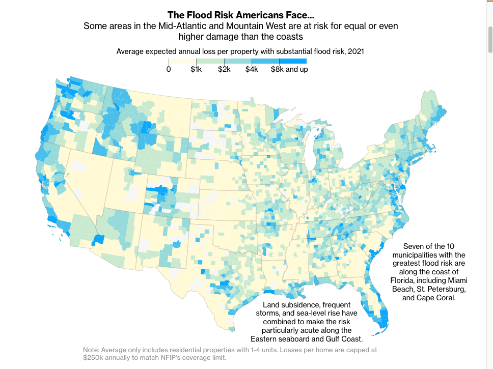
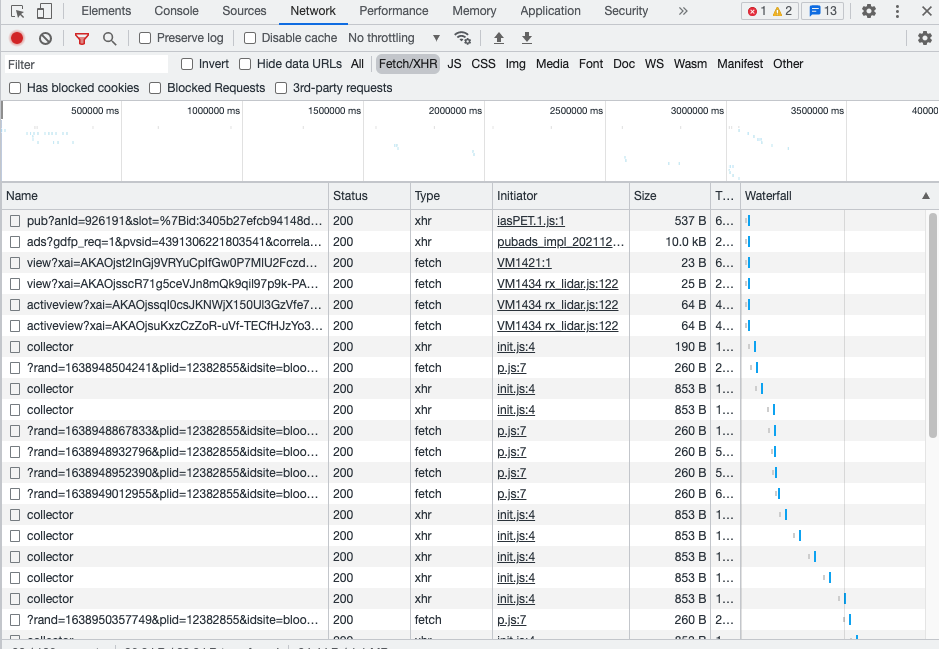
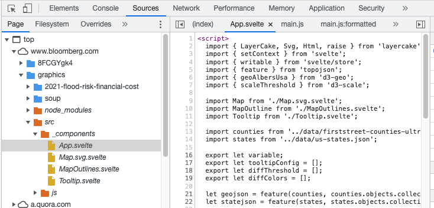
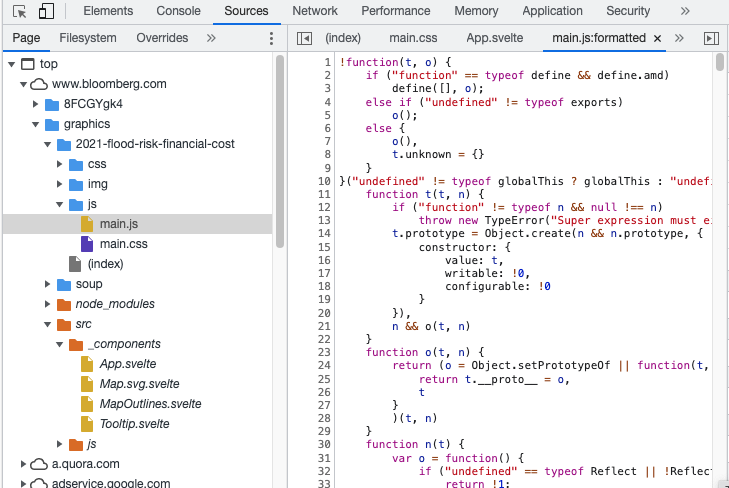
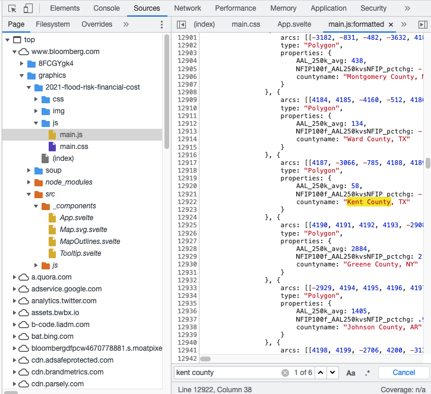
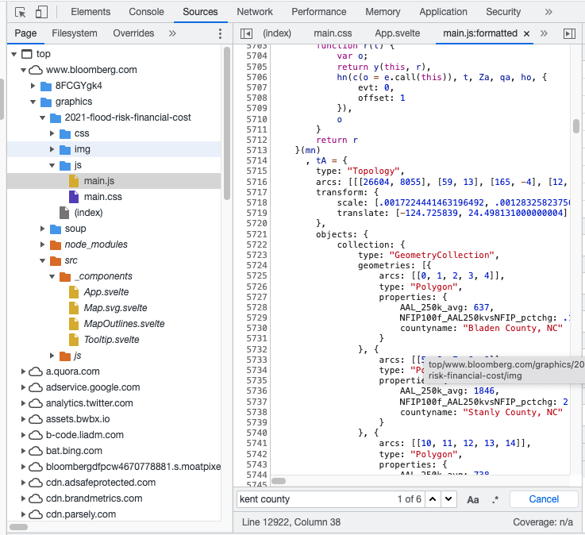

# Get Data Locally From Svelte

I was so enlightened by [Tyler Dukes' thread](https://twitter.com/mtdukes/status/1420193885750452227) about how to download data requested by the current website from other external sources.

Then I was thinking:

> How about datasets that are locally loaded?

I mean, all the `.svelte` files are compiled into `.html`,`.css` or `.js` format. Since I can't find those data files in the *Source* Panel (I use Chrome's devtool), maybe I should look into the `bundle` folder.

Let's use [Bloomberg's Flood Risk and Financial Cost](https://www.bloomberg.com/graphics/2021-flood-risk-financial-cost/) project to practice.

I'm interested in the county data they applied to US map,

but I can't find it either in *Network* panel or 

*Sources* Panel.

Now that I really want the data, I gotta check the compiled files, in this case, in *2021-flood-risk-financial-cost* folder.

Usually, I guess the data can be compiled into a `.js` file. Oof, this is a lot of code that I have no idea about... but no worry, I am only here for the county data.

 

I just need to brainstorm a US county that actually exists, which is the hardest part of this tutorial, and try to find it in this file. 

It's **Kent County**! And it exists! The data is in `main.js`!

Alright, I have the data, the end...

Just kidding, this county data has more than 25,000 rows. There is no way I am going to copy them by hand. My mouse' roller turned out not to be happy with that.

Here is the one-million dollar finding: all the data are contained in ONE variable.

If I can solely copy this variable, paste it to another file, and then name it `JSON` (or `csv`, it all depends on your desired data). Case closed!

1. So I right clicked `main.js/formatted` and saved it somewhere in my laptop.

2. I opened it in VSCode, where I can **expand** or **collapse** variables.
3. Of course, I collapsed it, and 25,000ish rows just become two rows.
4. Then I copied two rows(actually 25,000) and `JSON.stringify()` it in a console.
5. The last step is to copy and paste the final result in a JSON file.

Now I am off to go.